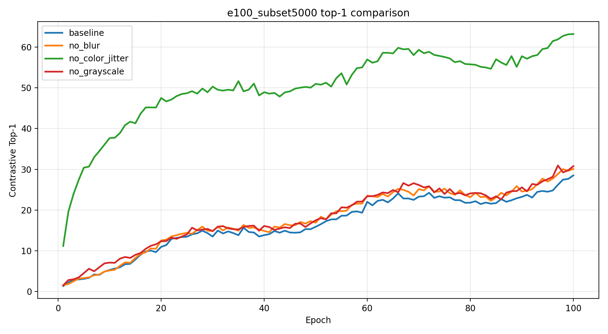
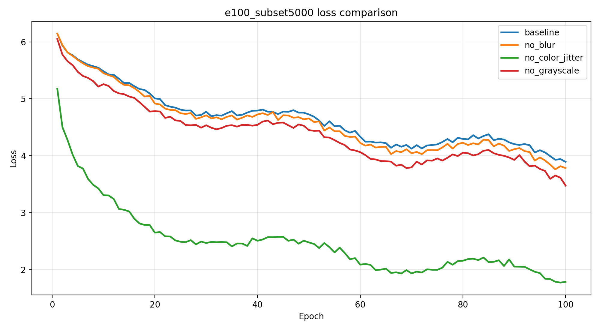
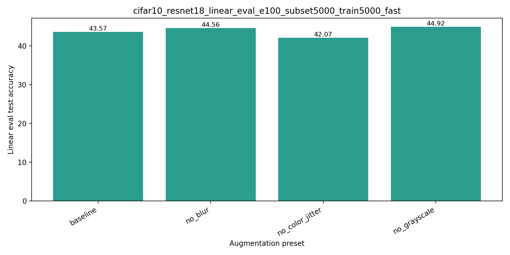
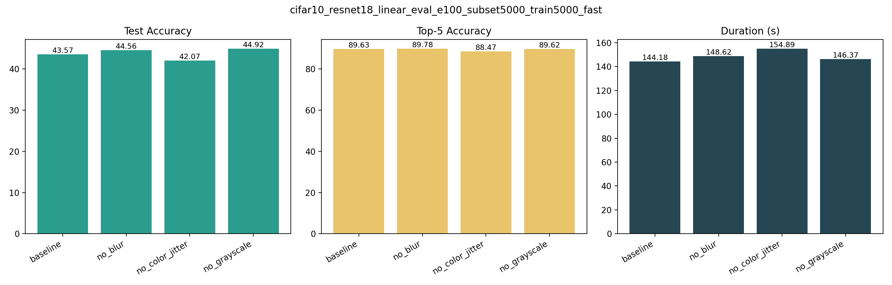

# SimCLR 100 Epoch 数据增强消融实验报告

这个仓库现在主要记录一次完整的 `CIFAR-10` 上 `SimCLR` 数据增强消融实验，以及对应的非 checkpoint 结果文件。

这次实验想回答的问题是：

> 在其他训练条件保持不变的前提下，`ColorJitter`、`GaussianBlur` 和 `RandomGrayscale` 对 SimCLR 预训练效果，以及下游线性评估结果，到底有什么影响？

这份 README 不再只是交接说明，而是直接作为本次实验的报告摘要使用。

## 1. 实验范围

本次报告只覆盖这一组正式对比：

- `baseline`
- `no_blur`
- `no_color_jitter`
- `no_grayscale`

这 4 组实验使用相同的 backbone、优化器、随机种子、训练样本数和 epoch 数，因此主要变量就是增强策略本身。

## 2. 固定实验配置

| 项目 | 数值 |
|---|---|
| 数据集 | `CIFAR-10` |
| Backbone | `ResNet-18` |
| Projection head dimension | `128` |
| Epochs | `100` |
| Batch size | `256` |
| Temperature | `0.07` |
| Learning rate | `0.0003` |
| Weight decay | `1e-4` |
| Views per image | `2` |
| Seed | `0` |
| 训练样本上限 | `5000` |
| 本次运行设备 | `cpu` (`--disable-cuda`) |
| Data loader workers | `0` |

下游评估部分使用的是：

- 冻结编码器
- 线性分类器
- `5000` 张 CIFAR-10 训练图像
- `10000` 张 CIFAR-10 测试图像

## 3. 对比的增强方案

当前仓库里的 baseline SimCLR 增强流水线是：

`RandomResizedCrop + RandomHorizontalFlip + RandomApply(ColorJitter, p=0.8) + RandomGrayscale(p=0.2) + GaussianBlur + ToTensor`

本次消融只改动一个组件：

| 方案 | 相对 baseline 的变化 |
|---|---|
| `baseline` | 完整增强流水线 |
| `no_blur` | 去掉 `GaussianBlur` |
| `no_color_jitter` | 去掉 `ColorJitter` |
| `no_grayscale` | 去掉 `RandomGrayscale` |

具体实现可以看 [data_aug/contrastive_learning_dataset.py](data_aug/contrastive_learning_dataset.py)。

## 4. 本次实验保留了哪些结果

这个仓库当前保留的是本次实验的非 checkpoint 结果：

- 训练汇总：`outputs/augmentation_suite/.../summary.json`
- 训练指标：`outputs/augmentation_suite/.../metrics.csv`
- 单实验训练曲线：`outputs/augmentation_suite/.../training_curves.png`
- 跨实验训练对比图：
  - `outputs/augmentation_suite/e100_subset5000_accuracy_vs_epoch_comparison.png`
  - `outputs/augmentation_suite/e100_subset5000_loss_vs_epoch_comparison.png`
- 线性评估汇总：
  - `outputs/linear_eval/cifar10_resnet18_linear_eval_e100_subset5000_train5000_fast_summary.csv`
  - `outputs/linear_eval/cifar10_resnet18_linear_eval_e100_subset5000_train5000_fast_summary.md`
  - `outputs/linear_eval/cifar10_resnet18_linear_eval_e100_subset5000_train5000_fast_test_accuracy.png`
  - `outputs/linear_eval/cifar10_resnet18_linear_eval_e100_subset5000_train5000_fast_visualization.png`

本地实际生成过最终 checkpoint，但因为体积较大，没有提交到 GitHub：

- `outputs/augmentation_suite/cifar10_resnet18_*_e100_subset5000_ckpt10/checkpoint_0100.pth.tar`

## 5. 训练阶段结果

下面这组指标来自 SimCLR 对比学习训练本身。

需要特别注意：

- 这里的 `contrastive top1/top5` 不是 CIFAR-10 分类准确率
- 它们反映的是对比学习任务内部，模型把正样本排到前面的能力

| 增强方案 | Final loss | Contrastive top-1 | Contrastive top-5 |
|---|---:|---:|---:|
| `baseline` | `3.892488` | `28.4951` | `46.2685` |
| `no_blur` | `3.783522` | `30.0884` | `47.9235` |
| `no_color_jitter` | `1.784125` | `63.2299` | `80.0781` |
| `no_grayscale` | `3.476313` | `30.7771` | `51.7167` |

训练阶段对比图：





### 训练阶段直观结论

如果只看 SimCLR 自身的优化指标，那么 `no_color_jitter` 看起来是压倒性最好的：

- loss 最低
- contrastive `top1/top5` 最高

但这还不是最终结论，因为它只反映预训练任务本身。

## 6. 冻结编码器线性评估结果

为了判断表示是否真的更适合下游分类，我们对每个 encoder 做了 frozen-encoder linear evaluation。

| 增强方案 | Train accuracy | Test accuracy | Test top-5 |
|---|---:|---:|---:|
| `baseline` | `71.50` | `43.57` | `89.63` |
| `no_blur` | `71.90` | `44.56` | `89.78` |
| `no_color_jitter` | `71.48` | `42.07` | `88.47` |
| `no_grayscale` | `72.94` | `44.92` | `89.62` |

线性评估可视化：





## 7. 这次实验最重要的发现

这组实验支持下面 4 个明确结论：

1. `no_grayscale` 是这次下游效果最好的方案。  
   它的 linear-eval test accuracy 是 `44.92`，比 `baseline` 高 `+1.35`。

2. `no_blur` 也优于 `baseline`。  
   它的 test accuracy 是 `44.56`，比 `baseline` 高 `+0.99`。

3. `no_color_jitter` 是这次最关键的反例。  
   它在对比学习训练指标上最好，但下游 test accuracy 只有 `42.07`，比 `baseline` 低 `-1.50`。

4. 预训练阶段指标更好，不代表下游表示一定更好。  
   这是这次实验最重要的方法论结论。

## 8. 如何解读这些结果

从结果来看，可以得到下面这些解释：

- `ColorJitter` 对迁移到分类任务的表示学习是重要的。
- `RandomGrayscale` 在这组设置里不一定有帮助，甚至可能略微有害。
- `GaussianBlur` 也不是必须的，在这里去掉以后反而有小幅提升。
- 只看 SimCLR 内部的 contrastive 指标，容易误判模型质量。

最典型的例子就是 `no_color_jitter`：

- 它的 contrastive loss 最低
- contrastive `top1/top5` 最高
- 但它的 linear-eval accuracy 反而最差

这说明去掉颜色扰动之后，预训练任务可能变得更容易了，但模型学到的特征不一定更适合真正的分类任务。

## 9. 实际建议

如果后续只能从这次实验里挑一个 encoder 继续做下游任务，当前建议排序是：

1. `no_grayscale`
2. `no_blur`
3. `baseline`
4. `no_color_jitter`

也就是说，后续如果要优先挑 checkpoint 继续 few-label、frozen encoder 或其他下游实验，最稳妥的两个候选是：

- `no_grayscale`
- `no_blur`

## 10. 如何复现

### 环境准备

```bash
conda env create --name simclr --file env.yml
conda activate simclr
```

### 从头训练 100 epoch augmentation ablation

```bash
python run_augmentation_suite.py \
  --data ./datasets_local \
  --dataset-name cifar10 \
  -a resnet18 \
  --epochs 100 \
  -b 256 \
  --temperature 0.07 \
  --seed 0 \
  --n-views 2 \
  --lr 0.0003 \
  --wd 1e-4 \
  -j 0 \
  --disable-cuda \
  --max-samples 5000 \
  --augmentations baseline no_blur no_color_jitter no_grayscale \
  --suite-name cifar10_resnet18_aug_ablation_e100_subset5000
```

### 如果已经有 50 epoch checkpoint，本地续训到 100 epoch

```bash
./resume_all_to_100.sh
```

### 生成训练阶段对比图

```bash
python plot_augmentation_training_comparison.py
```

### 跑 frozen-encoder linear evaluation

```bash
python run_linear_eval_suite.py \
  --max-train-samples 5000 \
  --suite-name cifar10_resnet18_linear_eval_e100_subset5000_train5000_fast
```

## 11. 关键文件

- `run.py`：单次 SimCLR 训练入口
- `simclr.py`：训练循环、checkpoint、指标保存、summary 导出
- `run_augmentation_suite.py`：批量运行增强消融实验
- `resume_all_to_100.sh`：把 4 个目标实验续训到 `100` epoch
- `linear_eval.py`：冻结编码器后的线性评估
- `run_linear_eval_suite.py`：批量线性评估与汇总输出
- `plot_augmentation_training_comparison.py`：跨实验训练曲线对比图
- `outputs/`：这次实验保留的非 checkpoint 结果

## 12. 一句话总结

在这次 `CIFAR-10 / ResNet-18 / 100 epoch / subset-5000` 实验里：

- 去掉 `ColorJitter` 会让 SimCLR 训练指标看起来明显更好
- 但它会让下游分类效果变差
- 去掉 `Grayscale` 的下游结果最好
- 去掉 `Blur` 也有小幅提升

所以这次实验最核心的结论不是“哪个增强方案赢了”这么简单，而是：

**SimCLR 训练阶段指标和下游迁移效果，可能会出现非常明显的不一致。**
